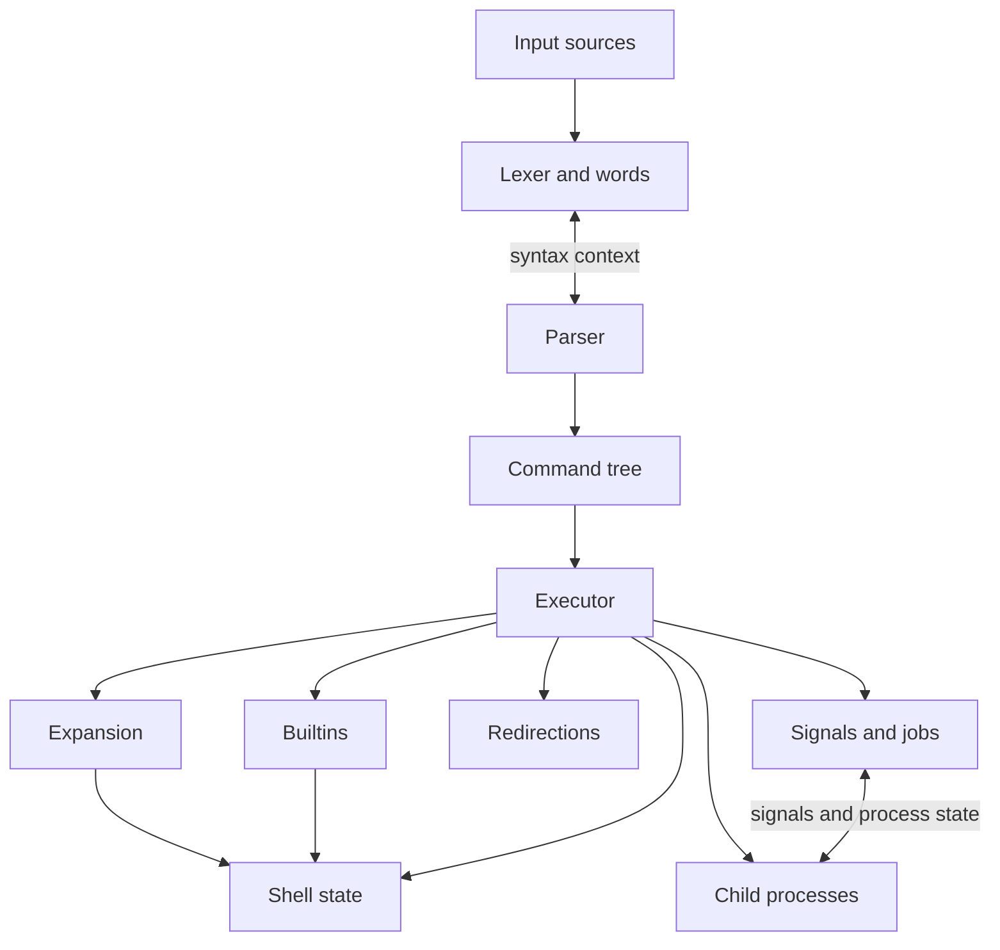

# Architecture

## Current implementation

`src/main.c` owns invocation parsing, state initialization, the complete-command
loop, diagnostics, prompts, and final status. It calls the input, lexer/parser,
AST, state, builtin, executor, and redirection modules described below.
The public `cshell` is the only runtime; CSH-039 removed the prototype input
loop, scanner, executor, and internal candidate driver. The handwritten lexer
requires no Flex or generated scanner.

The supported subset includes expanded simple commands, state builtins,
substitutions, here-documents, lists, groups, concurrent pipelines, and job
control, plus [conditionals, loops, case selection, and functions](control-flow.md).
Shell options are integrated by CSH-032; traps remain integration work.
See [Shell options](shell-options.md) for parsing, state and executor ownership.
Unsupported complete constructs are
rejected before execution. See [Runtime behavior](candidate-runtime.md).

## Current replacement modules

CSH-016 adds standalone input and invocation APIs, CSH-004 adds the lexer and
structured token/word API, CSH-005 adds parser/AST ownership, CSH-022 adds
shell-state storage, CSH-024 adds value expansion, CSH-025 adds final field
generation, and CSH-027 extends the parser with compound commands and function
definitions. CSH-030 adds alias substitution, and CSH-019 adds simple-command
execution and redirections. CSH-020 adds concurrent pipelines. These modules
have no dependency on the deleted legacy implementation.

CSH-018 connected invocation modes and shell statuses; CSH-039 makes that runtime
`src/main.c` and the default `cshell` executable. CSH-026 connects expansion and
substitution capture. CSH-031 integrates runtime aliases, nested evaluation,
command lookup, exec, and stateful utilities.

| Path | Responsibility |
| --- | --- |
| `src/input.c` / `include/cshell/input.h` | Owned string, script, and descriptor sources; physical lines, byte positions, explicit EOF, and sticky errors |
| `src/invocation.c` / `include/cshell/invocation.h` | Supported invocation options, owned `$0` and positional operands, interactive detection, and prompt selection |
| `src/lexer.c` / `include/cshell/lexer.h` | Owned tokens and fragment trees, incremental quote/substitution contexts, shared-cursor nested command lexers, and raw here-document handoff |
| `src/parser.c` / `include/cshell/parser.h` | Complete-command grammar, contextual words, nested command parsing, ordered here-document collection, and source diagnostics |
| `src/ast.c` / `include/cshell/ast.h` | Owned syntax nodes, words, substitutions, and ordered redirections with allocation-safe cleanup |
| `src/expand.c` / `include/cshell/expand.h` | Structured value expansion, quote/empty provenance, context restrictions, and lazy substitution handoff |
| `src/fields.c` / `src/pathname.c` | IFS field splitting, protected filename matching, owned final fields, and cooperative interruption |
| `src/arithmetic.c` / `include/cshell/arithmetic.h` | Checked signed-long arithmetic and grammar-only parser probe |
| `src/quote.c` / `include/cshell/quote.h` | Reusable dollar-single-quote decoding before expansion or delimiter quote removal |
| `src/state.c` / `include/cshell/state.h` | Owned variables and attributes, copied invocation parameters, option/status metadata, environment snapshots, and full-state and selective variable copying/restoration |
| `src/builtin.c` / `include/cshell/builtin.h` | State builtin lookup and handlers over replacement shell state |
| `src/utility.c` | Stateful read/getopts, process umask and resource limits, and CPU-time reporting |
| `src/prepare.c` / `src/prepare.h` | Phased context-sensitive word/assignment/redirection expansion and lazy substitution AST handoff |
| `src/execute.c` / `include/cshell/execute.h` | Owned prepared-command boundary, substitution capture, command lookup, owned child execution, assignment categories, parent builtin dispatch, concurrent pipelines, per-stage results, list/group evaluation, and background context ownership |
| `src/jobs.c` / `include/cshell/jobs.h` | Runtime job records, direct-child collection, process groups, terminal settings, safe signal wakeups, and job builtins |
| `src/redirect.c` / `include/cshell/redirect.h` | Ordered file, descriptor, and prepared here-document operations with descriptor restoration |

See [Input and invocation](input-and-invocation.md) for the concrete ownership,
descriptor, position, and error contracts. Physical input lines do not establish
command completeness; that remains the lexer/parser's responsibility. CSH-018
integrated runtime fixtures and CSH-039 switched the executable.
See [Lexer and words](lexer-and-words.md) for the feed contract and the parser
handshake: the parser decides which `)` closes a command substitution; the lexer
preserves its raw source and surrounding word context.

See [Parser and AST](parser-and-ast.md) for complete-command read boundaries,
error results, and tree ownership. This parser does not execute commands or
expand words.

See [Shell state](shell-state.md) for variable ownership, readonly errors, and
allocation-free checkpoint restoration. State stores option bits without
implementing their runtime behavior, and leaves special startup variable
initialization to CSH-029. CSH-023 uses selective variable saves for temporary
prefixes, preserving unrelated handler changes. Full-state checkpoints remain
available for complete rollback. The state module neither reads nor modifies
the process environment.

See [Value expansion](value-expansions.md) for intermediate fields, quoted empty
values, transactional expansion errors, arithmetic limits, and the parser/executor
handoffs, final IFS fields, pathname generation, and interruption cleanup.
CSH-026 integrates execution and here-document body tokenization/expansion.

See [Simple-command execution](execution.md) for command ownership, execution
categories, status and exit requests, child ownership, and descriptor restoration.
The runtime preflights supported syntax and expands each reached command using
CSH-026. Prefixes use CSH-023 assignment categories; resolved dispatch supplies
the boundary for future function/builtin handlers. CSH-029 supplies
[state builtins](state-builtins.md).

## Target module boundaries

The input, invocation, lexer, parser/AST, alias, quote, state, value-expansion,
field-generation, simple-command execution, and redirection
modules above exist. Add the remaining modules when their implementation
tickets start. This table defines target
responsibilities and does not claim that every listed module is implemented.

| Module | Owns | Must not own |
| --- | --- | --- |
| `input` | Source abstraction for strings, scripts, and stdin; byte positions; physical-line/EOF/error results | Command completeness, syntax interpretation, or execution |
| `invocation` | Input-mode and option selection, operand mapping, interactive detection, prompt selection | Parameter expansion, prompt output, or execution |
| `lexer` | Tokens and word fragments with quote/escape provenance | Expansion into final argument strings |
| `parser` / `ast` | Grammar, syntax errors, command trees, ordered redirections, deferred here-documents | Forks or global shell mutation |
| `alias` | Owned alias table and direct alias/unalias handlers; lexer/parser cooperate on substitution | Executing commands or reading descriptors |
| `variables` / `state` | Shell variables and attributes, positional parameters, options, last status | Scanning input |
| `expand` | Context-sensitive word expansion and field generation | Pipeline process management |
| `execute` | Tree evaluation, execution environments, command lookup, pipeline lifecycle and status | Parsing strings by searching for operators |
| `redirect` | Ordered descriptor operations and restoration for parent execution | Deciding which commands need a fork |
| `builtins` | Builtin dispatch and shell-state operations | A second parser or independent process launcher |
| `signals` / `jobs` | Signal dispositions, pending events, process groups, terminal ownership, job state | Signal-handler access to arbitrary mutable structures |

Public-to-the-project headers live under `include/cshell/`. Keep module-private
helpers `static`. Introduce shared types only when multiple modules need the
same contract; avoid a header that exposes every internal structure.

New modules must not import `cshell/legacy.h`, call legacy functions, or depend
on the scanner's flat argument vector. Do not copy the old dispatcher into a new
filename or preserve its assumptions in new interfaces. POSIX requirements and
the ownership contracts below determine the design; existing quirks and
unsupported operator spellings are not compatibility requirements.

## Processing model

The following diagram shows the processing model. Full trap integration remains
planned; the other runtime boundaries exist.
Input, lexer, and parser construct a command tree (AST). The executor
evaluates that tree and coordinates expansion, shell state, builtins,
redirections, and child processes. Arrows below the executor show collaborating
modules, not a fixed execution sequence.

Parsing and execution proceed at appropriate complete-command boundaries.
Aliases and here-documents require parser/lexer cooperation, and input must not
consume bytes intended for a command that reads stdin. Avoid a design that
unconditionally tokenizes or expands an entire script before executing it.
The module table above defines ownership even when a Markdown viewer cannot
render the diagram.

The tree records simple commands, pipelines, AND/OR and sequential/background
lists, compound commands, and functions. A word retains quoted and unquoted
fragments until expansion. Redirections preserve source order: `>out 2>&1` and
`2>&1 >out` are distinct operations.

## Ownership and failure contracts

These are design requirements for replacement modules, to be made concrete in
their tickets:

- Each allocated object has one documented owner and a matching cleanup path.
  APIs state whether pointers are borrowed, transferred, or newly allocated.
- Parsing returns a command tree, an incomplete-input result, EOF, or an error
  with a source location. It does not terminate the process directly.
- The executor owns launched child IDs, pipeline descriptors, and status
  collection. All child failure paths terminate the child.
- Builtins that affect the current environment can run in the parent with
  reversible descriptor changes; subshell contexts isolate those changes.
- Error results preserve the information needed for a diagnostic and shell
  status. Internal helpers do not print duplicate errors at every layer.
- Cleanup after failed allocation, redirection, or process creation is part of
  the module's contract and validation.

CSH-021 implements composition with a persistent `csh_execution_context` that
borrows shell state and owns a direct-child registry. Brace groups share the
current context under reversible descriptors; subshells, pipeline stages and
asynchronous lists use forked state/cwd/descriptor copies and fresh registries.
The executor preflights supported syntax before effects, then applies list
short-circuiting and honors exit requests within the owning context. Library
contexts without a job manager retain direct-child polling and explicit
blocking reaping. CSH-034 attaches a job manager in the runtime, transferring
launched PIDs to a retained registry and adding process groups, terminal handoff,
job builtins, and SIGCHLD wakeups during idle input. Shell exit still detaches
unfinished jobs; CSH-035 owns exit/hangup and trap policy. See
[Job control](job-control.md) and [Execution contexts](execution.md#lists-groups-and-background-contexts)
for lifecycle details and the synchronous convenience APIs.

## Replacement strategy

Keep module API fixtures independent of the runtime entry point. CSH-016 defines
input and invocation APIs; CSH-004 and CSH-005 establish tokens, words, and the
syntax tree. API fixtures validate these modules before the replacement can run
commands. CSH-019 adds command execution and redirections, and CSH-020 adds
pipelines. Input, allocation, descriptor, and child-process safety belong to
those modules from their first implementation.

CSH-018 integrated invocation modes and statuses through a temporary runtime
driver. CSH-039 promoted it to the public entry point and removed the alternate
build target. CSH-026 replaces the initial CSH-019 literal-word adapter with
context-sensitive preparation and isolated substitution execution, without
using legacy code or re-lexing expansion output. Unsupported syntax must
fail before the affected construct produces side effects, with no legacy
fallback.

[CSH-039](tickets/CSH-039-legacy-retirement.md) implements the cutover after
CSH-018 and CSH-020. It switches the default `cshell` executable to the new path
and verifies its documented bootstrap subset through native and Docker tests:
input modes, external commands, `cd`, `exit`, redirections, and pipelines. This
is an intermediate shell implementation; full builtin semantics and the
remaining POSIX features continue in their tickets.

The cutover removes these migration dependencies:

- `src/legacy/`, `include/cshell/legacy.h`, and the old input/dispatch loop are
  deleted from the current source tree.
- Legacy scanner generation, compilation rules, object files, linked symbols,
  and legacy-only build dependencies are absent from a clean build.
- The default executable has one runtime path; temporary migration drivers,
  fallback paths, feature switches, and compatibility adapters are removed.
- Prototype-specific test allowances, including non-interactive prompt
  stripping, are removed, and documentation describes the replacement's actual
  capabilities and limitations.
- The implementation contains no renamed or copied legacy dispatcher hidden
  behind the new module interfaces.

Git history and historical ticket evidence remain intact. Removal concerns the
current implementation and its dependencies, and requires no history rewrite.
The larger POSIX roadmap proceeds on the replacement after cutover; finishing
every later feature is not a prerequisite for deleting the prototype.

See the [ticket index](tickets/README.md) for sequencing and the
[POSIX tracking document](posix.md) for the behavior target.
