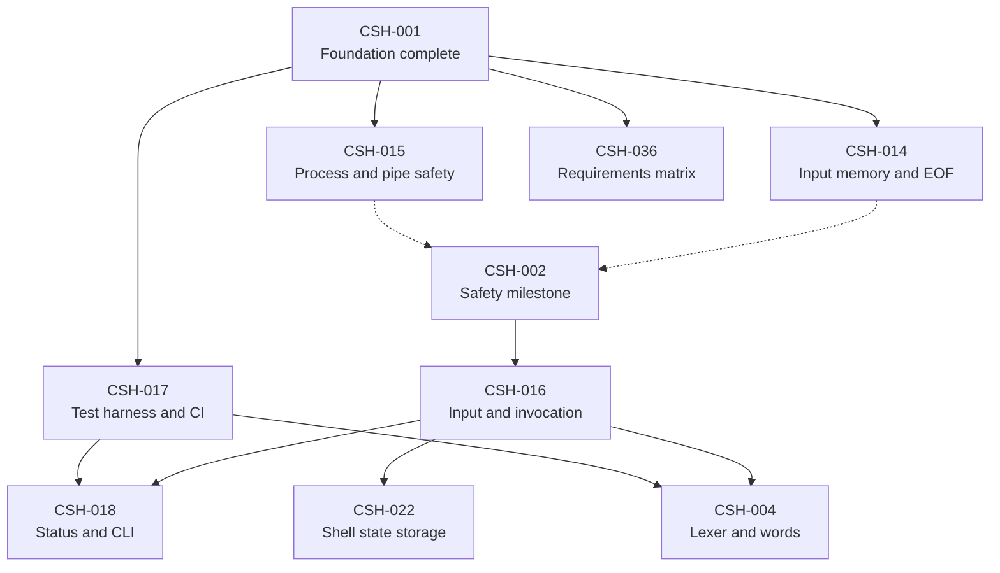
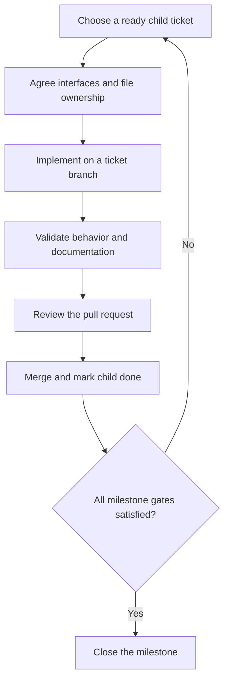

# Implementation plan

## Read the backlog as a dependency graph

Ticket numbers are stable identifiers, not a required execution order. The
[ticket index](tickets/README.md) distinguishes implementation tickets from
milestones. A milestone preserves the original scope and acceptance criteria;
its smaller child tickets are the units of implementation and review.

An implementation ticket can start when its own `Depends on` entries are done.
Its parent's prerequisites are completion gates for that milestone and are not
implicitly added to every child. A parent stays open until all children, its
prerequisites, and its original acceptance criteria are complete. This permits
early independent work without relaxing the final integration requirements.

## First parallel work

The following graph shows the first dependency paths. Solid arrows mean that
the source must complete before the destination can start. Dotted arrows roll
child completion into a milestone. CSH-013 maintains this plan and is separate
from the shell implementation paths.

The initial independent implementation tasks are CSH-014, CSH-015, CSH-017, and
CSH-036. Input/EOF work owns changes to the input loop; process-safety work owns
the legacy executor. Coordinate interface changes between those two tasks.
CSH-016 starts once the safety milestone is complete. The lexer and core state
store can then progress separately instead of waiting for the whole executor.

## Later parallel work

This table explains useful overlap; exact prerequisites remain in each ticket.
It is not permission to start work before those prerequisites are satisfied.

| Workstream | Implementation tickets | Integration boundary |
| --- | --- | --- |
| Language front end | CSH-004 lexer, CSH-005 parser, CSH-027 compound syntax | Agree word provenance, AST ownership, alias hooks, and here-document collection before parallel changes |
| Execution | CSH-019 simple commands/redirections, CSH-020 pipelines, CSH-021 lists and environments | One owner for child IDs, descriptor closure, waiting, and execution-result contracts |
| Shell state | CSH-022 storage and CSH-023 assignment environments | Storage can proceed beside the front end; command-category assignment rules need execution integration |
| Expansion | CSH-024 values, CSH-025 fields/pathnames, CSH-026 substitutions and here-documents | Pure expansion components start before the complete executor; command substitution waits for it |
| Compound programs | CSH-027 syntax and CSH-028 control flow/functions | Parser fixtures can run early; executable compounds wait for state, execution, and expansion |
| Builtins and options | CSH-029 state builtins, CSH-030 aliases, CSH-031 evaluation/utilities, CSH-032 options | Alias work uses front-end contracts; evaluation and error/option semantics require integrated execution |
| Terminal behavior | CSH-033 PTY harness, CSH-034 jobs, CSH-035 traps/signals | Harness construction can run early; process groups and reaping coordinate with the executor owner |
| Evidence | CSH-017 tests/CI, CSH-036 requirements, CSH-037 final audit | Grow evidence throughout; run the final audit only after the feature milestones |

Before implementing a workstream, read its child tickets and parent acceptance
criteria. A passing storage or parser unit test does not establish cross-feature
semantics. In particular, functions, special builtins, traps, and `errexit` need
later integration tests even when their supporting APIs were tested earlier.

## Work and review rhythm

Use two implementation streams plus a testing/documentation stream when useful.
Give each ticket a branch and isolated worktree. Agree on shared headers and
ownership before concurrent edits; avoid separate designs for the same parser
or process lifecycle contract.

In text: choose a dependency-ready child, agree its interfaces, implement and
validate it, and merge it after review. Check parent completion separately.
Code changes use both native and Docker checks as applicable; documentation-only
changes validate links, diagrams, and dependency consistency.

## Keeping GitHub and Markdown aligned

The ticket files hold the detailed plan; their `Issue` links locate the matching
GitHub Issues. Parent tickets also use GitHub's native sub-issue relationships.
Keep scope, dependencies, child checklists, and status aligned when editing
either representation. Source links in issues may point to the exact
commit under review so newly introduced ticket files remain accessible before
the documentation pull request reaches `main`.

Do not close a milestone merely because it was split. CSH-001 remains the
completed foundation ticket; the new implementation work remains open.
