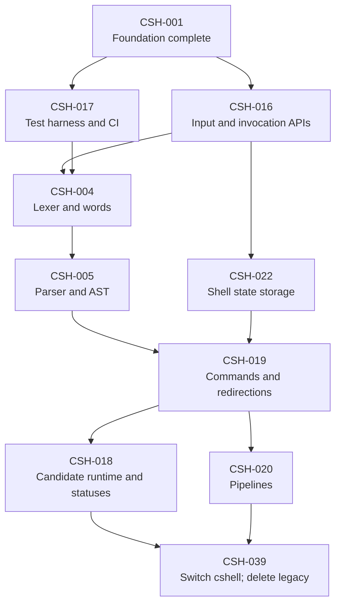
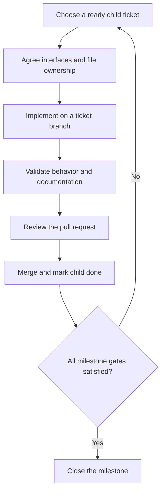

# Implementation plan

## Read the backlog as a dependency graph

Ticket numbers are stable identifiers, not a required execution order. The
[ticket index](tickets/README.md) distinguishes implementation tickets from
milestones. An active milestone groups the scope and acceptance criteria of its
smaller child tickets, which are the units of implementation and review.

An implementation ticket can start when its own `Depends on` entries are done.
Its parent's prerequisites are completion gates for that milestone and are not
implicitly added to every child. A parent stays open until all children, its
prerequisites, and its acceptance criteria are complete. This permits
early independent work without relaxing the final integration requirements.

The prototype is only a starting point. CSH-002, CSH-014, and CSH-015 are
superseded historical tickets, closed as not planned rather than completed. No
active ticket depends on them. Their defect evidence informs safety tests in
the replacement; it does not require a rewrite of the disposable implementation.
CSH-038 records this roadmap revision.

## First parallel work

The following graph shows the path to replacement and deletion of the original
runtime. Each arrow means that the source must complete before the destination
can start. Redundant transitive edges, milestone completion gates, and later
feature work are omitted; each ticket remains the source for its exact prerequisites.
CSH-036 can start independently and is outside the runtime cutover path shown.

The first parallel tasks are CSH-016, CSH-017, and CSH-036: input APIs, testing
infrastructure, and the POSIX requirements matrix. After the input contract is
available, the lexer/parser and state store can progress separately. The new
executor joins those interfaces; runtime/status integration and pipeline work
can then proceed in parallel before CSH-039.

CSH-016, CSH-004, and CSH-005 use API fixtures instead of adapters to the old
dispatcher. CSH-018 tests a candidate replacement runtime; CSH-039 switches the
default executable and deletes the legacy implementation. This cutover verifies
external commands, `cd`, `exit`, redirections, and pipelines through all supported
input modes in native and Docker tests. It does not wait for lists, compound
commands, complete expansion, or all later builtin semantics. Unsupported
constructs fail safely without falling back to the prototype.

The [architecture removal criteria](architecture.md#replacement-strategy)
include legacy source, headers, build rules, objects, symbols, compatibility
paths, and prototype-specific test allowances. Historical tickets and Git
history remain available; copied legacy code under new module names would not
satisfy the cutover.

## Later parallel work

This table explains useful overlap; exact prerequisites remain in each ticket.
It is not permission to start work before those prerequisites are satisfied.

| Workstream | Implementation tickets | Integration boundary |
| --- | --- | --- |
| Language front end | CSH-004 lexer, CSH-005 parser, CSH-027 compound syntax | Agree word provenance, AST ownership, alias hooks, and here-document collection before parallel changes |
| Execution | CSH-019 simple commands/redirections, CSH-020 pipelines, CSH-021 lists and environments | One owner for child IDs, descriptor closure, waiting, and execution-result contracts |
| Runtime cutover | CSH-018 candidate runtime/status integration and CSH-039 legacy retirement | CSH-039 follows CSH-018 and CSH-020, switches the default executable, and leaves one runtime path |
| Shell state | CSH-022 storage and CSH-023 assignment environments | Storage can proceed beside the front end; command-category assignment rules need execution integration |
| Expansion | CSH-024 values, CSH-025 fields/pathnames, CSH-026 substitutions and here-documents | Pure expansion components start before the complete executor; command substitution waits for it |
| Compound programs | CSH-027 syntax and CSH-028 control flow/functions | Parser fixtures can run early; executable compounds wait for state, execution, and expansion |
| Builtins and options | CSH-029 state builtins, CSH-030 aliases, CSH-031 evaluation/utilities, CSH-032 options | Alias work uses front-end contracts; evaluation and error/option semantics require integrated execution |
| Terminal behavior | CSH-033 PTY harness, CSH-034 jobs, CSH-035 traps/signals | Harness construction can run early; process groups and reaping coordinate with the executor owner |
| Evidence | CSH-017 tests/CI, CSH-036 requirements, CSH-037 final audit | Grow evidence throughout; run the final audit only after the feature milestones |

Before implementing a workstream, read its child tickets and parent acceptance
criteria. A passing storage or parser unit test does not establish cross-feature
semantics. In particular, functions, special builtins, traps, and `errexit` need
later integration tests even when their supporting APIs were tested earlier.

## Work and review rhythm

Use two implementation streams plus a testing/documentation stream when useful.
Give each ticket a branch and isolated worktree. Agree on shared headers and
ownership before concurrent edits; avoid separate designs for the same parser
or process lifecycle contract.

In text: choose a dependency-ready child, agree its interfaces, implement and
validate it, and merge it after review. Check parent completion separately.
Code changes use both native and Docker checks as applicable; documentation-only
changes validate links, diagrams, and dependency consistency.

## Keeping GitHub and Markdown aligned

The ticket files hold the detailed plan; their `Issue` links locate the matching
GitHub Issues. Parent tickets also use GitHub's native sub-issue relationships.
Keep scope, dependencies, child checklists, and status aligned when editing
either representation. Source links in issues may point to the exact
commit under review so newly introduced ticket files remain accessible before
the documentation pull request reaches `main`.

Do not close a milestone merely because it was split. Completed tickets require
acceptance and integration evidence. Superseded tickets retain their historical
scope and the reason work was replaced; close their GitHub issues as not planned.
Never mark them done or silently treat supersession as a satisfied dependency.
Remove or redirect incoming dependencies as part of the replacement plan.
