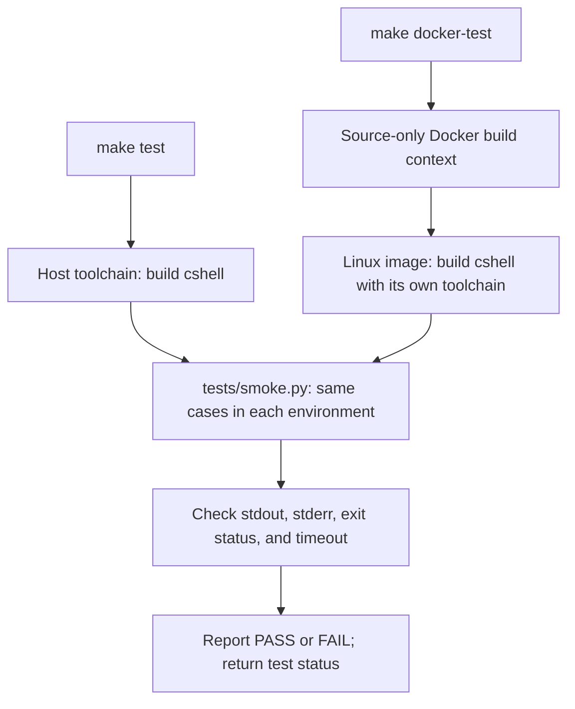

# Testing cshell

## Current coverage

The current suite checks startup, explicit exit, external command execution, and
successive commands. Each case runs in a temporary directory with a five-second
timeout. The runner checks output, stderr, and exit status, and kills the test
process group on timeout.

These are smoke checks for the prototype. They tolerate its known `Shell> `
prompt on non-interactive stdout, and explicitly send `exit` because EOF handling
is incomplete. Passing them does not establish POSIX compliance or correct
quoting, pipelines, redirections, or signal behavior.

Both supported test entry points use the same smoke runner. Native tests build
with the host toolchain; Docker copies source into an image and builds with its
Linux toolchain. Each path checks stdout, stderr, exit status, and timeouts:



The diagram describes the current smoke suite. Planned behavioral,
pseudo-terminal, and conformance coverage is listed under
[Growing the suite](#growing-the-suite).

## Native tests

Install the build dependencies from the [README](../README.md) and Python 3:

```sh
make test
```

`make test` builds `cshell` when necessary and runs `tests/smoke.py`. To test a
specific executable or change the timeout:

```sh
python3 tests/smoke.py ./cshell --timeout 10
```

## Docker tests

Install Docker with a running Linux container engine. A local C compiler, Flex,
or Python installation is not needed for the Docker path.

From the repository root:

```sh
make docker-test
```

This builds the test image from the current source files and runs `make test`
inside it. The image uses Debian Bookworm, GCC, GNU Make, Flex, and Python 3.
The executable is compiled inside the image, so an existing macOS binary or host
object files cannot affect the Linux result. Uncommitted source edits are
included. Tests run as a non-root user, and the container is removed on exit.

Docker uses the engine's default platform (typically Linux arm64 on Apple
Silicon, Linux amd64 on Intel/AMD). The initial image build needs network access
to fetch the base image and Debian packages. The image is a development/test
environment rather than a release package; its release tag is fixed, while
security updates can change the resolved image and packages.

Additional commands:

```sh
make docker-build  # Build the image without running tests
make docker-shell  # Open /bin/sh in the built image for investigation
make docker-test DOCKER_IMAGE=cshell-test:experiment
```

The default image name is `cshell-test:local`; `DOCKER` overrides the Docker
command. The helpers use a source snapshot in the image, without mounting the
working directory. Run `make docker-test` again after edits to rebuild affected
layers. Changes made inside `make docker-shell` disappear when the container
exits.

Equivalent Docker commands, which do not require host Make:

```sh
docker build --tag cshell-test:local .
docker run --rm --init cshell-test:local
```

For a clean refresh of the toolchain, use `docker build --pull --no-cache --tag
cshell-test:local .`, then run the image. CI can use the same build/run commands;
container execution is not yet wired into a hosted CI service.

If Docker reports that it cannot connect to the daemon, start Docker Desktop or
the configured engine and check `docker info`. Build and test failures propagate
through `make docker-test` as a nonzero exit status.

## Growing the suite

- [CSH-016](tickets/CSH-016-input-and-invocation.md) and
  [CSH-004](tickets/CSH-004-lexer-and-words.md) cover replacement input/EOF and
  allocation safety; [CSH-019](tickets/CSH-019-simple-command-redirections.md)
  and [CSH-020](tickets/CSH-020-pipeline-lifecycle.md) cover child/descriptor
  failures and high-volume pipelines. The superseded legacy repair tickets
  remain defect history, not required implementation work.
- [CSH-003](tickets/CSH-003-invocation-and-test-harness.md) extends the runner to
  script and `-c` modes, strict output/status checks, filesystem effects, and CI.
- [CSH-011](tickets/CSH-011-signals-and-job-control.md) adds pseudo-terminal tests.
- [CSH-012](tickets/CSH-012-conformance-and-portability.md) audits coverage and
  supported environments, including compiler/libc versions.

CSH-018 runs strict fixtures against an explicitly selected replacement runtime
before the default executable changes. Legacy quirks are not golden outputs.
[CSH-039](tickets/CSH-039-legacy-retirement.md) moves both standard test targets
to the replacement `cshell`, removes prototype-only allowances and temporary
drivers, and validates clean builds with no legacy sources or objects.

Keep native macOS validation alongside Docker. Linux containers do not validate
Darwin-specific terminal, signal, or library behavior.
